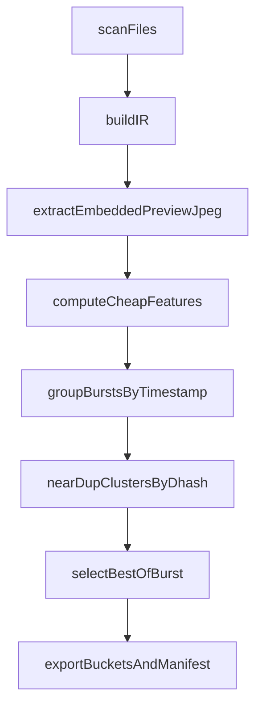

# qrate: compiler-style roadmap (minimal, no-AI-first)

### Core framing (compiler analogy)

- **Front-end**: ingest directory trees of assets (RAW/JPEG/video later) + user intent flags.
- **IR (intermediate representation)**: a stable, typed record per asset (path + metadata + derived cheap features + relationships like burst/cluster).
- **Passes**: deterministic transforms over IR (filter, group, dedupe, score, select).
- **Back-end**: emits artifacts (bucket dirs via copy/link + machine-readable manifest; later XMP, catalogs, DNG previews).

### Design constraints (explicit)

- **No AI / no heavy compute yet**: stick to embedded preview JPEG + small downscales; no demosaic, no deep nets.
- **Minimal surface area**: a few clear phases, few dependencies, no background daemons.
- **Deterministic by default**: selection should be reproducible; randomness (if any) must be seeded.
- **Non-destructive**: never delete; export is copy/link + manifest.

---

### MVP-1 (still valuable, no LLM)

Goal: end-to-end cull pipeline that works on RAW dirs using **embedded preview JPEG**.

#### 1) Index + IR

- **Scan**: recurse input dir for `--ext` (start with `.NEF`, later allow many).
- **IR record** (per file):
- identity: path, size, mtime
- time: EXIF `DateTimeOriginal` (fallback to mtime)
- optional camera/lens basics (nice-to-have)
- **exact-dupe hash**: start with `hashlib.blake2b` (stdlib). Upgrade to `blake3` later if needed.
- **Caching policy** (minimal + no surprise files):
- default: keep IR in memory for a run; always write manifest to output dir
- optional: `--cache <path>` writes sqlite (stdlib `sqlite3`) for incremental runs

#### 2) Preview extraction (embedded JPEG)

- Provide a preview extraction strategy with safe fallbacks:
- **Preferred**: if `exiftool` is available, ask it for embedded preview bytes (robust across RAW makers).
- **Fallback**: best-effort pure-Python extraction (e.g., locate embedded JPEG segments); if it fails, degrade to metadata-only and skip preview-based passes for that file.
- Normalize preview: decode → resize to small fixed size (e.g. 512px long edge) for feature computation.

#### 3) Cheap “technical garbage” filters (on preview)

Compute features per asset (fast, scalar):

- **Blur/motion**: variance of Laplacian on grayscale.
- **Exposure extremes**: histogram clipping (percent of pixels near 0/255) and mean/percentiles.
- **Noise proxy**: simple high-frequency energy vs signal (or ISO from EXIF if present).

Output: a per-file **tech score** + flags: `too_blurry`, `too_dark`, `too_bright`, `clipped_highlights`, etc.

#### 4) Burst grouping + near-dup clustering

- **Burst grouping**: sort by timestamp; group contiguous frames within a time delta (configurable `--burst-seconds`, default ~2s).
- **Near-dup** (cheap):
- compute **dHash** on preview (e.g. 9x8 luminance) → 64-bit hash
- cluster by Hamming distance threshold (configurable)
- Practical rule: do near-dup primarily **within bursts** first (keeps compute bounded and aligns with real-world behavior).

#### 5) Best-of-burst selection (no “taste” yet)

Scoring should be explicit and boring:

- **Base** = sharpness score
- **Penalties** = clipped highlights/shadows, extreme exposure, heavy noise
- **Tie-breakers** = prefer non-duplicates; prefer mid-exposure
- “Face/subject presence” in MVP-1 is risky because it drags in OpenCV/ML; instead:
- MVP-1: use a **saliency proxy** (edge density in central region, entropy) as a weak stand-in
- keep the API open so MVP-1.5 can add optional face detect as a plugin/optional extra

#### 6) Export + manifest

- **Buckets**: `best/`, `good/`, `maybe/`, `trash/` under `--out-dir`.
- **Export mode**: `--export {hardlink,symlink,copy}`.
- default: try hardlink, fallback to copy (cross-device errors)
- **Manifest**: write `manifest.jsonl` (one record per file) and `summary.json` with counts and thresholds.
- Keep the existing `--out export.txt` path list output for backward compatibility (can be derived from manifest).

CLI direction (compatible evolution):

- Keep current entrypoint `qrate <input_dir> --out <export.txt> ...`
- Add optional: `--out-dir <dir>`, `--export ...`, `--burst-seconds`, `--dedupe-hamming`, `--min-sharpness`, `--max-clip`.

---

### MVP-2 (taste learning, still cautious)

Goal: learn your preferences *without* giant models.

- **Interactive loop**: a small TUI that, for each burst/cluster, shows 2–4 candidates and you pick winners.
- **Training data**: store choices as pairwise preferences (A>B) rather than absolute labels.
- **Model**:
- Start with **cheap features + dHash/thumbnail stats** (no CLIP yet) to prove the loop.
- Then add embeddings behind a flag (local, optional dependency).
- **Rerank**: combine tech score + learned preference score; keep weights explicit and inspectable.

---

### MVP-3 (LLM intent + explanations)

Goal: LLM as a front-end parser/critic, not an executor.

- **Natural language → strict JSON plan** (schema-validated). Only whitelisted actions.
- **Explainability**:
- Deterministic “why selected” generated from features (sharpness, exposure, uniqueness), optionally *polished* by LLM.
- Keep the raw reasons in machine form so you can audit.

---

### What changes in the current repo (minimal)

Current code is a single-module CLI in [`src/qrate/__init__.py`](/Users/swap357/qrate/src/qrate/__init__.py). To keep things readable as complexity grows, use **two internal modules max**:

- [`src/qrate/pipeline.py`](/Users/swap357/qrate/src/qrate/pipeline.py): IR types + pipeline passes (scan, group, score, select).
- [`src/qrate/preview.py`](/Users/swap357/qrate/src/qrate/preview.py): embedded preview extraction + dHash + image feature helpers.

`__init__.py` stays as the public surface and CLI glue (re-export core funcs).

### Acceptance criteria (MVP-1)

- Runs on a RAW dir and produces: