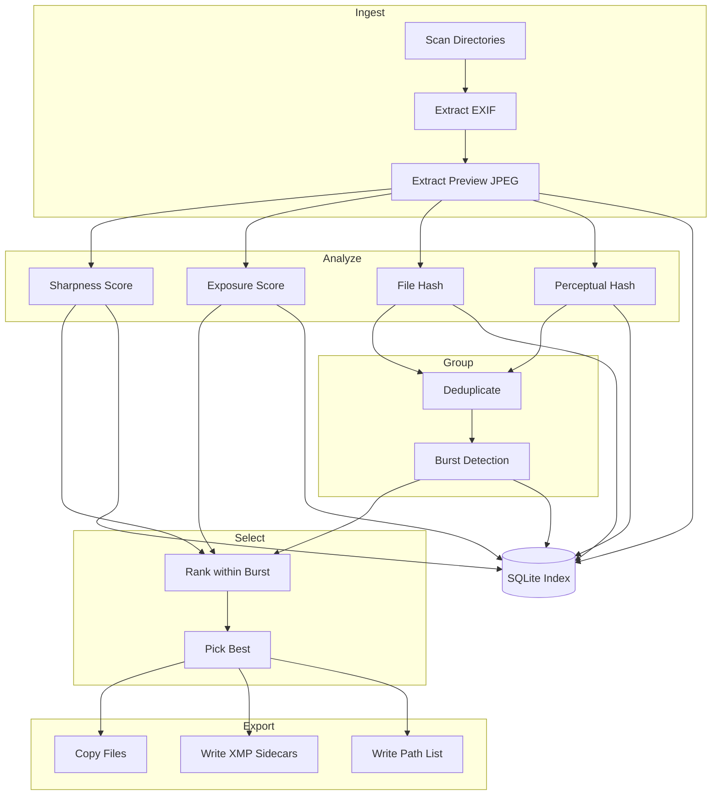

# qrate: Image Compiler Architecture

## Core Metaphor

Like a compiler: `source → lex → parse → optimize → codegen`

```javascript
RAW files → Index → Analyze → Score → Select → Export
                ↓
            [SQLite DB + Preview Cache]
```

---

## Architecture Overview



---

## Data Model

```python
# Core entities in SQLite
ImageRecord:
    path: str (primary key)
    hash_blake3: str
    hash_perceptual: str  # 64-bit pHash as hex
    exif_timestamp: datetime
    exif_iso: int
    exif_shutter: float
    exif_aperture: float
    exif_focal_length: float
    preview_path: str
    
QualityScores:
    path: str (foreign key)
    sharpness: float      # Laplacian variance
    exposure_score: float # histogram-based
    noise_estimate: float # derived from ISO + variance
    
BurstGroup:
    group_id: int
    paths: list[str]
    best_path: str
    
SelectionResult:
    path: str
    rank: int
    reason: str  # "best-of-burst", "unique", etc.
```

---

## MVP-1: Technical Culling (No AI)

**Goal**: Remove obvious garbage, group bursts, pick best-of-burst using signal processing only.

### Components

| Component | Method | Library ||-----------|--------|---------|| Preview extraction | Embedded JPEG from RAW | rawpy, exiftool || Sharpness | Variance of Laplacian | OpenCV or scipy || Exposure | Histogram clipping analysis | numpy || Exact dedup | blake3 hash | blake3 || Near dedup | pHash, Hamming distance ≤ 8 | imagehash || Burst detect | Timestamp proximity + pHash similarity | custom || Best-of-burst | argmax(sharpness + exposure_score) | custom |

### CLI Interface

```bash
# Index a directory (incremental)
qrate index /path/to/raws

# Show stats
qrate status

# Run culling pipeline
qrate cull --keep-per-burst 1 --min-sharpness 100

# Export results
qrate export --top 200 --out ./selected --format xmp
qrate export --top 200 --out ./selected --format copy
qrate export --top 200 --out ./selected.txt --format list
```


### File Structure (MVP-1)

```javascript
src/qrate/
    __init__.py          # CLI entry, current code
    db.py                # SQLite schema + queries
    ingest.py            # scan, EXIF, preview extraction
    analyze.py           # sharpness, exposure, hashing
    group.py             # dedup, burst detection
    select.py            # ranking, best-of-burst
    export.py            # copy, XMP, list output
```


### Dependencies to Add

```toml
[project]
dependencies = [
    "rawpy>=0.18",
    "Pillow>=10.0",
    "imagehash>=4.3",
    "blake3>=0.4",
    "numpy>=1.24",
]

[project.optional-dependencies]
cv = ["opencv-python-headless>=4.8"]  # for Laplacian, optional
```

---

## MVP-2: Taste Learning

**Goal**: Learn user preferences from A/B picks, rerank with personal taste model.

### Components

| Component | Method ||-----------|--------|| Embeddings | CLIP-ViT-B/32 or OpenCLIP (local) || TUI picker | Textual or blessed || Preference model | Logistic regression on embedding diffs || Reranking | taste = w*aesthetic + (1-w)*technical |

### New CLI

```bash
# Interactive picker TUI
qrate learn --bursts 50

# Apply learned model
qrate cull --use-model ./taste.pkl
```


### New Files

```javascript
src/qrate/
    embed.py             # CLIP embedding extraction
    learn.py             # preference training
    tui.py               # Textual-based picker
```

---

## MVP-3: LLM Intent

**Goal**: Natural language → structured pipeline execution.

### Components

| Component | Method ||-----------|--------|| Intent parser | LLM → JSON schema || Explain | Generate selection rationale || Batch workflows | Named presets |

### CLI

```bash
qrate "select best 50 portraits from last weekend for exhibition"
# → parses to: cull --filter faces --date-range ... --top 50 --quality exhibition
```

---

## Implementation Order

### Phase 0: Foundation (refactor current code)

- [ ] Add SQLite DB schema ([src/qrate/db.py](src/qrate/db.py))
- [ ] Refactor current `find_raw_files` into proper indexer
- [ ] Add multi-format RAW support (NEF, CR2, ARW, DNG)

### MVP-1 (4-6 weeks of focused work)

- [ ] EXIF extraction + preview extraction
- [ ] Sharpness scoring (Laplacian variance)
- [ ] Exposure scoring (histogram analysis)
- [ ] blake3 + pHash deduplication
- [ ] Burst detection (timestamp clustering)
- [ ] Best-of-burst selection
- [ ] Export: copy, XMP sidecars, path list

### MVP-2 (after MVP-1 is solid)

- [ ] CLIP embedding pipeline
- [ ] TUI picker
- [ ] Preference classifier
- [ ] Reranking

### MVP-3 (after MVP-2 is validated)

- [ ] Intent parsing
- [ ] Explain summaries

---

## Key Design Decisions

1. **SQLite as index** — single file, portable, queryable, handles 100k+ images fine
2. **Preview cache** — extracted JPEGs stored alongside DB for fast reprocessing
3. **Incremental by default** — only process new/changed files (mtime + hash check)
4. **XMP sidecars** — Lightroom-compatible output, non-destructive
5. **No face detection in MVP-1** — deferred to MVP-2 with proper embeddings